# System Design & Architecture - Rate Limiter

## 1. Architectural Overview

This rate limiter is built with a modular, decoupled C++ architecture following SOLID design principles.
The system decouples **Rate Limiting Algorithms** from **Storage Backends**, allowing any algorithm to run on either **In-Memory** cache or **Redis** cache.

---

## 2. Key Design Patterns & Principles

1. **Strategy Pattern**
   - Applied to: `IRateLimiter`
   - Purpose: Allows swapping rate-limiting algorithms (Fixed Window, Sliding Window, Token Bucket) dynamically without altering caller code or HTTP controllers.

2. **Interface Segregation Principle (ISP)**
   - Applied to: Storage Interfaces (`IFixedWindowStorage`, `ISlidingWindowStorage`)
   - Purpose: Each rate limiter algorithm only sees storage operations relevant to itself. Compile-time enforcement prevents Fixed Window from calling Sliding Window storage methods.

3. **Bridge Pattern**
   - Applied to: Rate Limiter to Storage Interface binding
   - Purpose: Decouples algorithm logic from physical persistence (In-Memory vs. Redis).

4. **Factory Pattern**
   - Applied to: `RateLimiterFactory`
   - Purpose: Encapsulates instantiation and dependency injection of rate limiters and storage backends from application configuration.

---

## 3. Low-Level Design (LLD) Diagram

```mermaid
classDiagram
direction LR

%%=========================
%% Client
%%=========================

class Controller {
    +allowRequest(key)
}

%%=========================
%% Strategy
%%=========================

class IRateLimiter {
    <<interface>>
    +allowRequest(key) bool
}

class FixedWindowRateLimiter
class SlidingWindowLogRateLimiter
class SlidingWindowCounterRateLimiter
class TokenBucketRateLimiter
class LeakyBucketRateLimiter

IRateLimiter <|.. FixedWindowRateLimiter
IRateLimiter <|.. SlidingWindowLogRateLimiter
IRateLimiter <|.. SlidingWindowCounterRateLimiter
IRateLimiter <|.. TokenBucketRateLimiter
IRateLimiter <|.. LeakyBucketRateLimiter

Controller --> IRateLimiter

%%=========================
%% Storage Interfaces (ISP)
%%=========================

class IFixedWindowStorage {
    <<interface>>
}

class ISlidingWindowStorage {
    <<interface>>
}

class ITokenBucketStorage {
    <<interface>>
}

class ILeakyBucketStorage {
    <<interface>>
}

FixedWindowRateLimiter --> IFixedWindowStorage
SlidingWindowLogRateLimiter --> ISlidingWindowStorage
SlidingWindowCounterRateLimiter --> ISlidingWindowStorage
TokenBucketRateLimiter --> ITokenBucketStorage
LeakyBucketRateLimiter --> ILeakyBucketStorage

%%=========================
%% In-Memory Storage
%%=========================

class InMemoryFixedWindowStorage
class InMemorySlidingWindowStorage
class InMemoryTokenBucketStorage
class InMemoryLeakyBucketStorage

IFixedWindowStorage <|.. InMemoryFixedWindowStorage
ISlidingWindowStorage <|.. InMemorySlidingWindowStorage
ITokenBucketStorage <|.. InMemoryTokenBucketStorage
ILeakyBucketStorage <|.. InMemoryLeakyBucketStorage

%%=========================
%% Redis Storage
%%=========================

class RedisFixedWindowStorage
class RedisSlidingWindowStorage
class RedisTokenBucketStorage
class RedisLeakyBucketStorage

IFixedWindowStorage <|.. RedisFixedWindowStorage
ISlidingWindowStorage <|.. RedisSlidingWindowStorage
ITokenBucketStorage <|.. RedisTokenBucketStorage
ILeakyBucketStorage <|.. RedisLeakyBucketStorage

%%=========================
%% Factory
%%=========================

class RateLimiterFactory {
    +createLimiter()
}

RateLimiterFactory --> IRateLimiter
```

## 4. Component Flow Summary

1. **Client / Controller** calls `allowRequest(key)` on an `IRateLimiter` instance.
2. **Rate Limiter** computes window/bucket boundaries and formats the storage key.
3. **Rate Limiter** delegates persistence calls strictly to its dedicated storage interface (`IFixedWindowStorage`, `ISlidingWindowStorage`).
4. **Storage Engine** (`InMemory` or `Redis`) executes thread-safe operations and returns atomic results.
